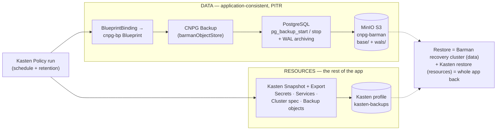

# Application-Consistent PostgreSQL Backups on Kubernetes: CloudNativePG, Barman, and Kasten

Most "database backup" stories on Kubernetes quietly cheat. You take a volume
snapshot of the PVC, tick a box, and move on. The problem is that a raw volume
snapshot of a running database is only *crash-consistent* — it's the equivalent of
pulling the power cord and hoping the database recovers cleanly on the way back up.
Usually it does. Sometimes it doesn't. "Usually" is not a backup strategy.

What we actually want is:

1. An **application-consistent** backup — one the database engine itself coordinates,
   so it's guaranteed restorable to a consistent point, with **point-in-time recovery**.
2. That backup **orchestrated alongside the rest of the application** — the secrets,
   services, and the cluster definition — so a restore brings back the *whole* app, not
   just a `data.tar.gz` you then have to reassemble by hand.

This post walks through building exactly that for PostgreSQL, using three tools that
each do one job well:

| Layer | Tool | Job |
|---|---|---|
| Run Postgres | **CloudNativePG** (CNPG) | Operator that runs HA PostgreSQL declaratively |
| Back up Postgres | **Barman** (built into CNPG) | PostgreSQL-native, application-consistent backup to S3 |
| Orchestrate it | **Veeam Kasten** | Trigger the DB backup *and* capture all the K8s resources |

Everything runs on a local Kubernetes cluster — in my case a bare-metal Talos cluster
with Rook-Ceph for storage and MinIO providing S3 — but it maps cleanly to any cluster
with a CSI storage class and an S3-compatible object store.

Here's the whole flow. One policy run drives two parallel paths — the **data** goes out
application-consistently via Barman, and the **resources** go out via Kasten — and a
restore reassembles both:



---

## Part 1 — Deploy PostgreSQL with CloudNativePG

You *could* run Postgres from a Helm chart as a StatefulSet. But then day-2 — failover,
backups, minor upgrades — is your problem. An operator encodes that operational
knowledge as code: you declare *what* you want, it reconciles reality to match.
[CloudNativePG](https://cloudnative-pg.io) is the modern, Kubernetes-native choice.

Install the operator:

```bash
helm repo add cnpg https://cloudnative-pg.github.io/charts
helm repo update
helm upgrade --install cnpg --namespace cnpg-system --create-namespace cnpg/cloudnative-pg
```

Then declare a cluster. This is the entire database — three instances (one primary, two
streaming replicas with automatic failover), persistent storage on our block storage
class, and an application database:

```yaml
apiVersion: postgresql.cnpg.io/v1
kind: Cluster
metadata:
  name: pg
  namespace: postgres
spec:
  instances: 3
  storage:
    size: 5Gi
    storageClass: ceph-block
  bootstrap:
    initdb:
      database: appdb
      owner: app
```

Apply it and CNPG bootstraps the primary (`initdb`), then joins each replica. Within a
couple of minutes:

```
NAME  INSTANCES   READY   STATUS                     PRIMARY
pg    3           3       Cluster in healthy state   pg-1
```

The operator also generated three Services — `pg-rw` (always the primary), `pg-ro`
(replicas), `pg-r` (any) — and a `pg-app` secret with the application credentials. Note
`pg-rw` follows the primary automatically on failover, so your apps never hardcode a pod.

{: .alert-info }
**Gotcha #1 — CRD name collisions.** If you also run Kasten (or anything else with a
`Cluster` CRD), `kubectl get cluster` is ambiguous. Always fully-qualify CNPG:
`kubectl get clusters.postgresql.cnpg.io`.

---

## Part 2 — Application-consistent backups with Barman

Here's the important bit. CNPG has Barman built in. Point it at an S3 bucket and it does
two things continuously:

- **Base backups** using PostgreSQL's low-level backup API (`pg_backup_start` /
  `pg_backup_stop`). This is *not* a filesystem snapshot — the database engine
  coordinates it, so the result is guaranteed consistent and restorable.
- **WAL archiving** — every write-ahead-log segment is shipped to the bucket, which is
  what gives you **point-in-time recovery**: restore to any moment, not just to the last
  base backup.

Because a base backup is a *physical* backup of the whole instance, it captures **every
database** in the cluster, not just one.

Add the backup config to the cluster spec (the credentials live in a `barman` secret with
`aws_access_key_id` / `aws_secret_access_key`):

```yaml
spec:
  # ... instances, storage, bootstrap as before ...
  postgresql:
    parameters:
      archive_timeout: "5min"        # see Gotcha #3
  backup:
    retentionPolicy: "30d"
    target: prefer-standby           # run base backups on a replica, offload the primary
    barmanObjectStore:
      destinationPath: s3://cnpg-barman
      endpointURL: http://minio.minio.svc.cluster.local:9000
      s3Credentials:
        accessKeyId:     { name: barman, key: aws_access_key_id }
        secretAccessKey: { name: barman, key: aws_secret_access_key }
      wal:  { compression: gzip }
      data: { compression: gzip }
```

Take a backup with a `Backup` resource:

```yaml
apiVersion: postgresql.cnpg.io/v1
kind: Backup
metadata: { name: backup-1, namespace: postgres }
spec:
  method: barmanObjectStore
  cluster: { name: pg }
```

`kubectl get backup` shows it reach `completed`, and the objects land in the bucket:

```
s3://cnpg-barman/pg/base/20260820T154708/{backup.info,data.tar.gz}
s3://cnpg-barman/pg/wals/0000000200000000/...gz
```


*The MinIO console showing the `cnpg-barman` bucket — the base backups under `base/` and the
archived WAL under `wals/`. Your "the data really landed" proof.*

That's an application-consistent backup with PITR. But three things bit me here, and
they're the kind of thing you want to learn in a blog post rather than in an incident:

{: .alert-info }
**Gotcha #2 — `encryption: ""` is dead.** Older examples set `wal.encryption: ""` to
disable server-side encryption. CNPG 1.30's webhook rejects it — the field now only
accepts `AES256`/`aws:kms`. To disable SSE, **omit the field entirely**.

{: .alert-info }
**Gotcha #3 — an idle database can produce un-restorable backups.** A backup is only
restorable if its **`begin_wal` segment is in the archive**. WAL segments are only
shipped when they *fill or are switched* — so on a quiet database, the current segment
lingers un-archived, and a backup that references it fails at restore with
`WAL ... not found`. The fix is `archive_timeout` (above): force a WAL archive on a
schedule regardless of write activity. I found this the hard way — my first two
"successful" backups were quietly un-restorable. Always verify:<br><br>
`BEGIN=$(kubectl -n postgres get backup <name-o jsonpath='{.status.beginWal}')`
`# confirm s3://cnpg-barman/pg/wals/.../$BEGIN.gz exists`

{: .alert-info }
**Gotcha #4 — Barman's in-tree config is on the way out.** `spec.backup.barmanObjectStore`
is **deprecated and removed in CNPG 1.31.0**. It works fine on 1.30, but before you
upgrade, migrate to the new **Barman Cloud Plugin**. Same approach, config moves to a
plugin.

### Restoring

Restore in CNPG is a deliberate recreate — you bootstrap a *new* cluster from the backups.
This restores **all databases**, and can target a specific backup or a point in time:

```yaml
apiVersion: postgresql.cnpg.io/v1
kind: Cluster
metadata: { name: pg-restored, namespace: postgres }
spec:
  instances: 1
  storage: { size: 5Gi, storageClass: ceph-block }
  bootstrap:
    recovery:
      source: pg
      # recoveryTarget: { backupID: "20260820T154708" }   # or targetTime for PITR
  externalClusters:
    - name: pg
      barmanObjectStore:
        destinationPath: s3://cnpg-barman
        endpointURL: http://minio.minio.svc.cluster.local:9000
        wal: { compression: gzip }
        s3Credentials:
          accessKeyId:     { name: barman, key: aws_access_key_id }
          secretAccessKey: { name: barman, key: aws_secret_access_key }
```

I wrote a marker row, backed up, recovered into a fresh cluster, and the row was there.
The full cycle works. But notice what this *doesn't* cover: the `barman` and `pg-app`
secrets, the Services, the Cluster definition itself. If the whole namespace is gone,
you need those back too — and that's where Kasten comes in.

---

## Part 3 — Orchestrate it all with Veeam Kasten

Barman protects the *data*. It does **not** protect the Kubernetes objects around it. A
real disaster — a deleted namespace, a lost cluster — needs both: the data *and* the
resources, backed up together and driven on a schedule. That's the orchestration layer.

The trick is to **not** let Kasten take a naive volume snapshot of the Postgres PVCs
(that would be crash-consistent — the thing we're trying to avoid). Instead, Kasten uses a
**Blueprint** to delegate the data backup to CNPG's application-consistent Barman path,
while it captures all the surrounding Kubernetes resources itself.

Thanks to Michael Courcy's [kasten-cnpg blueprint](https://github.com/michaelcourcy/kasten-cnpg),
this is two objects:

- A **Blueprint** (`cnpg-bp`) whose backup action creates a CNPG `Backup` object and waits
  for it to complete (and whose delete action removes it when a restore point expires).
- A **BlueprintBinding** (`cnpg-bp-binding`) that binds that blueprint to *any*
  `clusters.postgresql.cnpg.io` in the cluster — automatically.

```bash
kubectl apply -f cnpg-blueprint.yaml
kubectl apply -f cnpg-blueprint-binding.yaml
```

The binding is the key insight: **you do not reference the blueprint in your policy.** A
lot of people expect to pick a blueprint when creating the policy — you don't. The binding
wires it up, so a plain namespace policy Just Works, and Kasten runs the blueprint whenever it
backs up a matching CNPG cluster.

So the policy is an ordinary namespace backup + export:

```yaml
apiVersion: config.kio.kasten.io/v1alpha1
kind: Policy
metadata: { name: postgres-backup, namespace: kasten-io }
spec:
  frequency: "@daily"
  retention: { daily: 7, weekly: 4 }
  actions:
    - action: backup
      backupParameters:
        profile: { name: kasten-backups, namespace: kasten-io }   # see Gotcha #5
    - action: export
      exportParameters:
        frequency: "@daily"
        profile: { name: kasten-backups, namespace: kasten-io }
        exportData: { enabled: true }
  selector:
    matchExpressions:
      - key: k10.kasten.io/appNamespace
        operator: In
        values: [ postgres ]
```

Run it, and you can watch the chain fire: the policy run triggers the blueprint, a new
`backup-pg-<timestamp>` CNPG Backup object appears, Barman completes it to S3, and Kasten
snapshots and exports the namespace's Kubernetes resources to the location profile.


*The two policies in the Kasten dashboard, and a green successful run of `postgres-backup`.*


*A restore point, expanded — note the captured `backups.postgresql.cnpg.io` object alongside the
namespace's other resources. That's the orchestration doing its job.*

{: .alert-info }
**Gotcha #5 — the Kanister action needs a profile on the *backup* action.** The blueprint
runs as a Kanister action during the *backup* phase. If you only put a location profile on
the *export* action, it fails with `kanister-profile not found`. Put a `profile` under
`backupParameters` too. This is the "define a profile for the kanister action, it's
mandatory" note in the blueprint README, and it's easy to miss.

### Backing up the backups

One subtlety: when a policy run *creates* a new CNPG `Backup` object, that object didn't
exist when the run started — so it isn't in that run's restore point. To make sure your
restore points always contain the Backup specs (which carry the `backupId` you need to
recover after a total loss), add a second, high-frequency policy that captures just those
objects:

```yaml
  actions:
    - action: backup
      backupParameters:
        profile: { name: kasten-backups, namespace: kasten-io }
        filters:
          includeResources:
            - { group: postgresql.cnpg.io, version: v1, resource: backups }
    - action: export
      # ... export to the same profile ...
```

### The full disaster recovery

Now you're covered end to end. To recover from a deleted namespace:

1. Restore the **`barman` and `pg-app` secrets** from a Kasten restore point (so you can
   reach the bucket and keep the app credentials).
2. Recover the CNPG cluster from Barman using the `bootstrap.recovery` spec above, reading
   the `backupId` from the captured Backup object.

Data comes from Barman (application-consistent, PITR); everything else comes from Kasten.
That's the combination that actually gets you back online.

---

## Lessons learned

- **Volume snapshots are not database backups.** Use the engine's own backup path
  (Barman via CNPG) for application consistency, and let your orchestrator *trigger* it
  rather than snapshot underneath it.
- **Verify restores, don't assume them.** Two of my early backups were silently
  un-restorable because of the idle-WAL problem. A backup you haven't restored is a
  hypothesis, not a backup. Set `archive_timeout`, and check the `begin_wal` is archived.
- **Read the version notes.** The in-tree Barman config is deprecated; `encryption: ""`
  is gone. Blindly copying older examples will bite you.
- **Understand the binding vs. the policy.** With a BlueprintBinding you don't attach the
  blueprint to the policy — but the Kanister action still needs a location profile on the
  backup action. Small detail, hard failure.

## Wrap-up

Three tools, three jobs: CloudNativePG runs an HA Postgres declaratively, Barman gives you
application-consistent physical backups with point-in-time recovery straight to object
storage, and Kasten orchestrates that backup alongside every Kubernetes resource the app
needs — on a schedule, with retention, and a restore path you've actually tested.

That last clause is the whole point. Backups are easy; *restores* are the feature. Build
the chain, then break something on purpose and put it back together — because the first
time you run a restore should never be during an incident.

---

*Part of [#90DaysOfDataEngineering](https://github.com/MichaelCade/90DaysOfDataEngineering).
Blueprint credit: [michaelcourcy/kasten-cnpg](https://github.com/michaelcourcy/kasten-cnpg).*
